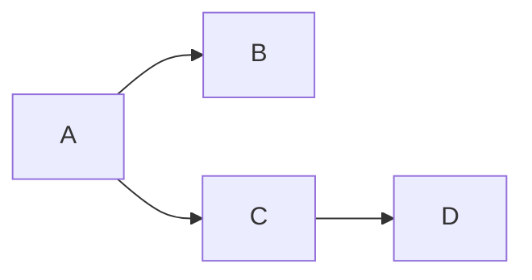

با استفاده از [لینک](https://katex.org/docs/support_table.html) میتوان تمام دستورات Katex را در داخل دو عدد $ ابتدا و انتها قرار داد و کد نوشته شده ریاضی نمایش داده می شود.

```ruby

$$f(x) = \int_{-\infty}^\infty \hat f(\xi)\,e^{2 \pi i \xi x} \,d\xi$$

```

نتیجه کد بالا برابر با زیر خواهد بود :

$$f(x) = \int_{-\infty}^\infty \hat f(\xi)\,e^{2 \pi i \xi x} \,d\xi$$


