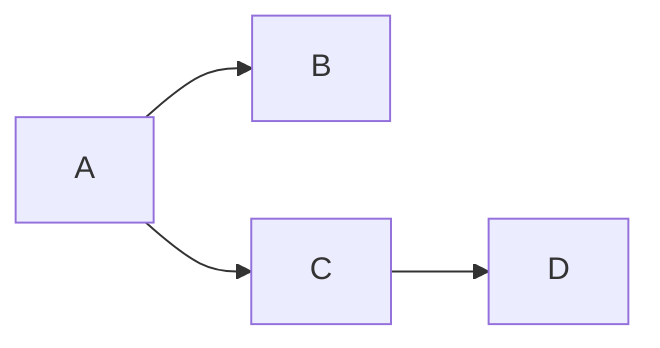

### p1

به طور کلی یک تفاوت اساسی وجود دارد بین برنامه نویسی مرسوم و برنامه نویسی الگوریتم های ML .
در برنامه نویسی مرسوم ما داده ی ورودی (input) و قوانین (rules) را به برنامه میدهیم و در جواب و خروجی (answer) را میگیریم.
مثلا درآمد و هزینه را به عنوان ورودی به یک برنامه میدهیم و از طرفی به آن میگوییم سود حاصل تفریق این دو پارامتر است و در جواب سود را میگیریم.
ولی در الگوریتم های machine learning ، ورودی ها data و answer است و در خروجی rules را میگیریم.
در مثال خودمان،چند نمونه از درآمد و هزینه را به عنوان ورودی و همچنین اینکه در هر مورد چقدر سود کرده ایم یا ضرر را به عنوان پاسخ به سیستم می‌دهیم و در جواب rule یعنی سود،مخارج و درآمد را میگیریم.




این دیاگرام بسیار مهم و گویا است.
در حقیقت در یک مسئله ML ، ما به سیستم مثال هایی میدهیم که در واقع چه میخواهیم ببینیم،و از کامپیوتر میخواهیم rule هارا کشف کند.

### p2

دو مفهوم خیلی مهم در بحث ML وجود دارد.
Examples , labels
مثال خوبی که در صورت تفاوت Traditional Programming و Machine Learning وجود دارد ، مسئله‌ی Activity Recognition است.
در حالت اول مثلا میتوانیم بگوییم اگر سرعت کمتر از 4km/h بود، walking هست بین 4 و 12 ، running هست و بالاتر از اون biking ؛ ولی سوال اینجاست اگر بخواهیم gulfing را بفهمیم، تکلیف چیست؟ کار خیلی سخت است.
ولی در مسئله‌ی ML ، میتوانیم مثال های متفاوت و مختلفی از هر کدام از این فعالیت ها به سیستم بدهیم و از آن بخواهیم خودش قوانین را استخراج کند. بدین صورت میتوان انواع فعالیت‌ها را تشخیص داد.
در ادامه به سراغ deep learning و neural network میرویم که یکی از مهمترین مفاهیم و ابزارهای ما در مبحث Machine Learning هستند.

Machine learning is all about a computer learning a pattern to distinguish things.

خب این course خیلی سریع سراغ کدنویسی رفته. نکته مهم و مثبت این است که من ویدیوهای مربوط به deep learning رو پیش تو مطالعه کردم. پس مشکلی نیست.
این اولین خط برنامه نویسی ماست.

Model =keras.Sequential([keras.layers.dense(units=1, input-shape=[1])])

### p3

### p4


این یک مسئله‌ی regression هست و خط آنها در حقیقت مدل ماست که بر آن مبنا قیمت هر خانه را بر مبنای size آن تخمین میزنیم یعنی size ورودی و قیمت خروجی است.


حال میتوانیم فرض کنیم که علاوه برسانید، پارامترهای بیشتری داریم برای تخمین قیمت؛ مثلا تعداد اتاق zip code,wealth پس نیاز به neuron های بیشتری داریم.


نکته‌ی بسیار مهم اینکه هر کدام از این پارامترها در هر مرحله یک وزن مخصوص به خود دارند.

فعلاً ما با همان NN ساده کار میکنیم.

### p5

همانطور که میدانیم مباحث Machine Learning مملو است از فرمول و روابط ریاضی در keras این روابط در یک سری توابع آمده است.

Model.compile (optimizer=’sgd’,loss=mea^squared error’)

در ابتدا طبیعتاً NN هیچ ایده‌ای از خروجی مطلوب ندارد.بنابراین یک حدس اولیه را در نظر میگیرد.سپس از دیتایی که ما به عنوان ورودی در اختیارش قرار میدهیم استفاده میکند تا متوجه شود تا چه حد حدس اولیه‌اش درست یا غلط بوده است تابع loss در حقیقت این را اندازه میگیرد. و سپس نتیجه را به optimizer میدهد و optimizer حدس بعدی را امتحان میکند.

Each guess should be better than the one before.

وقتی که حدس‌ها بهتر و بهتر شد ، loss کمتر و کمتر شد و دقت ما به %100 میل کرد از کلمه‌ی convergence استفاده میکنیم.

Sgd = schotastic gradient descent.

برای دانستن درمورد sgd و همچنین آپشن های دیگری که داریم میتوانیم tensorflow documentation مراجعه کنیم.

مرحله بعدی کارما این است که known data را وارد کنیم.

```python

xs=np.array([-1,0,1,2,3,4],dtype=float)
ys=np.array([-3,-1,1,3,5,7],dtype=float)

```

### p6

### p7

محتمل است که جواب دقیقِ دقیق حاصل نشود.

Week2:
تا اینجا یک مسئله‌ی خیلی خیلی ساده را بررسی کردیم؛ اینکه ارتباطی بین دو مجموعه پیدا کنیم. حالا می‌خواهیم کمی پیش برویم و وارد دنیای Computer Vision بشویم.

Computer Vision is the field of having a computer understand and label what is present in an image.

در این قسمت قرار است روی Fashion MNIST کار کنیم.
در حقیقت مسئله این است که ما تعداد بسیار زیادی تصویر ورودی به کامپیوتر میدهیم و از آن می‌خواهیم که pattern استفاده میکند برای تشخیص unseen data.


مهمترین مسئله و تفاوت در این مرحله با مرحله‌ی قبل،input data خواهد بود. در این جا ما عکس‌های gray-scale داریم در سایز 28*28 پس بجای یک nearon در ورودی، 28*28 تا خواهیم داشت خب،نکته‌ی جالب این است که این data در keras موجود است.

```python

fashion-mnist=keras.datasets.fashion-mnist(train-images,train-labels),(test-images-test-labels)
=fashion-mnist.lood-data)

```

### p8

### p9

در لایه اول مثل این نیست که در حد پیکسل-پیکسل تصویر بررسی میشود و مثلاً خمیدگی،خطوط راست،خطوط کج تشخیص داده میشود. در لایه‌ی دوم،با استفاده از اطلاعات لایه اول،اشکال واضح تری مثل یقه،آستین،بند کفش و… تشخیص داده میشود. مثلاً اگر یک مربع ⃣ در لایه‌ی اول تشخیص داده شده بود از یک جیب در نظر میگیرد. یا یک خط دراز میتوان بند باشد. حال در مرحله آخر، مثلاً اگر یک جیب،یک یقه و دو آستین تشخیص داده شده باشد،در لایه‌ی آخر nearon مربوط به پیراهن روشن میشود.
\*آنچه که در این فرایند باید تصحیح شود،وزن‌ها هستند.

.بهتر کار میکند normalized با NN

در درس deep learning گرفتیم که عموماً در neuron هایی که داریم نیاز به activation هایی داریم که nor-linear باشند؛ لذا برای این کار یک راه relu است.


Softmax takes a set of values, and effectively picks the biggest one.

اگر ورودی softmax این باشد.
[0.1,0.1,0.5,0.9,0.3]
خروجی این است⇐[0,0,0,1,0]
