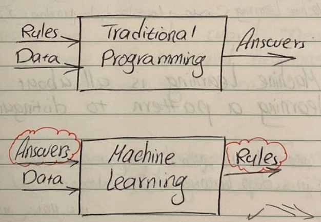

### p1

به طور کلی یک تفاوت اساسی وجود دارد بین برنامه‌نویسی مرسوم و برنامه نویسی الگوریتم های ML .
در برنامه نویسی مرسوم ما داده ی ورودی (input) و قوانین (rules) را به برنامه میدهیم و در جواب و خروجی (answer) را میگیریم.
مثلا درآمد و هزینه را به عنوان ورودی به یک برنامه میدهیم و از طرفی به آن میگوییم سود حاصل تفریق این دو پارامتر است و در جواب سود را میگیریم.
ولی در الگوریتم های machine learning ، ورودی ها data و answer است و در خروجی rules را میگیریم.
در مثال خودمان،چند نمونه از درآمد و هزینه را به عنوان ورودی و همچنین اینکه در هر مورد چقدر سود کرده ایم یا ضرر را به عنوان پاسخ به سیستم می‌دهیم و در جواب rule یعنی سود،مخارج و درآمد را میگیریم.
<!---

--->

این دیاگرام بسیار مهم و گویا است.
در حقیقت در یک مسئله ML ، ما به سیستم مثال هایی میدهیم که در واقع چه میخواهیم ببینیم،و از کامپیوتر میخواهیم rule هارا کشف کند.

### p2

دو مفهوم خیلی مهم در بحث ML وجود دارد.
Examples , labels
مثال خوبی که در صورت تفاوت Traditional Programming و Machine Learning وجود دارد ، مسئله‌ی Activity Recognition است.
در حالت اول مثلا میتوانیم بگوییم اگر سرعت کمتر از 4km/h بود، walking هست بین 4 و 12 ، running هست و بالاتر از اون biking ؛ ولی سوال اینجاست اگر بخواهیم gulfing را بفهمیم، تکلیف چیست؟ کار خیلی سخت است.
ولی در مسئله‌ی ML ، میتوانیم مثال های متفاوت و مختلفی از هر کدام از این فعالیت ها به سیستم بدهیم و از آن بخواهیم خودش قوانین را استخراج کند. بدین صورت میتوان انواع فعالیت‌ها را تشخیص داد.
در ادامه به سراغ deep learning و neural network میرویم که یکی از مهمترین مفاهیم و ابزارهای ما در مبحث Machine Learning هستند.

Machine learning is all about a computer learning a pattern to distinguish things.

خب این course خیلی سریع سراغ کدنویسی رفته. نکته مهم و مثبت این است که من ویدیوهای مربوط به deep learning رو پیش تو مطالعه کردم. پس مشکلی نیست.
این اولین خط برنامه نویسی ماست.

```python
Model =keras.Sequential([keras.layers.dense(units=1, input-shape=[1])])
```
### p3

این خط از برنامه با استفاده از زبان python و tensorflow با کمک یک API در tensorflow به نام keras  نوشته شده است.
Keras تعریف Neular net  را در محیط tensorflow  بسیار ساده میکند.
A neural network is a set of functions that can learn patterns.
آنچه که ما در این یک خط برنامه نوشتیم، در حقیقت ساده ترین نمونه یک neural network است که فقط یک neuron دارد.

<!---  --->

در keras ما از کلمه ی dense برای تعریف یک لایه از  neuran استفاده میکنیم.
In keras, we use the word “dense” to define a layer of connected neurons.
از کلمه sequential برای تعریف لایه های سر هم استفاده میکنیم.
همچنین لازم است که input-shape برای اولین لایه تعریف شود که در این مثال ساده ترین حالت در نظر گرفته شده.فقط یک neuron و فقط یک ورودی.
به نظرم خالی از لطف نیست که اولین مثال از یک  neural network را که مربوط به درس  deep learning مربوط به Andrew Ng بود اینجا بازگو کنیم.
فرض کنیم که در همان مثال معروف Andrew یک سری داده و Label داریم (مبحث ML ) و میخواهیم در مورد داده های جدید تصمیم بگیریم.

### p4

<!---   --->

این یک مسئله‌ی regression هست و خط آنها در حقیقت مدل ماست که بر آن مبنا قیمت هر خانه را بر مبنای size آن تخمین میزنیم یعنی size ورودی و قیمت خروجی است.

<!---  --->
حال میتوانیم فرض کنیم که علاوه برسانید، پارامترهای بیشتری داریم برای تخمین قیمت؛ مثلا تعداد اتاق zip code,wealth پس نیاز به neuron های بیشتری داریم.

<!---   --->
نکته‌ی بسیار مهم اینکه هر کدام از این پارامترها در هر مرحله یک وزن مخصوص به خود دارند.

فعلاً ما با همان NN ساده کار میکنیم.

### p5

همانطور که میدانیم مباحث Machine Learning مملو است از فرمول و روابط ریاضی در keras این روابط در یک سری توابع آمده است.

```python

Model.compile (optimizer=’sgd’,loss=mea^squared error’)

```
در ابتدا طبیعتاً NN هیچ ایده‌ای از خروجی مطلوب ندارد.بنابراین یک حدس اولیه را در نظر میگیرد.سپس از دیتایی که ما به عنوان ورودی در اختیارش قرار میدهیم استفاده میکند تا متوجه شود تا چه حد حدس اولیه‌اش درست یا غلط بوده است تابع loss در حقیقت این را اندازه میگیرد. و سپس نتیجه را به optimizer میدهد و optimizer حدس بعدی را امتحان میکند.

Each guess should be better than the one before.

وقتی که حدس‌ها بهتر و بهتر شد ، loss کمتر و کمتر شد و دقت ما به %100 میل کرد از کلمه‌ی convergence استفاده میکنیم.

Sgd = schotastic gradient descent.

برای دانستن درمورد sgd و همچنین آپشن های دیگری که داریم میتوانیم tensorflow documentation مراجعه کنیم.

مرحله بعدی کارما این است که known data را وارد کنیم.

```python

xs=np.array([-1,0,1,2,3,4],dtype=float)
ys=np.array([-3,-1,1,3,5,7],dtype=float)

```

### p6
The training takes place in “fit” command.
Model.fit (xs,ys,epochs=500)
در اینجاست که در حقیقت از مدل میخواهیم بفهمد چگونه باید مقادیر x را به y متناظر کند. در حقیقت میخواهیم rule ها را کشف کند.
Epochs=500 در حقیقت میگوید که لوپ training ، 500 بار تکرار شود.
*این لوپ همان است که در پیش گفتیم.
Make a guess
Measure how good or bad the guess is by loss
Use the optimizer and the daea to make a better guess
وقتی فاز training تمام شد، سپس مقادیر مربوط  به unseen data با دستور  predict تخمین زده میشوند.
([Print(model,predict ([10,0
جواب صحیح که 19 است چرا که 19=2×10-1 ولی پاسخی که مدل به ما میدهد دقیقا برابر 19 نیست.عددی است که بسیار به 19 نزدیک است مثال:18.981285  ولی چرا؟
دو دلیل دارد:
اولین مسئله این است که در این مثال خاص تعداد داده ورودی ما بسیار کم است. پس تعداد داده ی ورودی،عاملی مهم در میزان دقت مدل است.
اصولا کار با NN به معنی کار با احتمالات است لذا خیلی محتمل است که جواب دقیق دقیق حاصل نشود.


### p7

محتمل است که جواب دقیقِ دقیق حاصل نشود.

Week2:
تا اینجا یک مسئله‌ی خیلی خیلی ساده را بررسی کردیم؛ اینکه ارتباطی بین دو مجموعه پیدا کنیم. حالا می‌خواهیم کمی پیش برویم و وارد دنیای Computer Vision بشویم.

Computer Vision is the field of having a computer understand and label what is present in an image.

در این قسمت قرار است روی Fashion MNIST کار کنیم.
در حقیقت مسئله این است که ما تعداد بسیار زیادی تصویر ورودی به کامپیوتر میدهیم و از آن می‌خواهیم که pattern استفاده میکند برای تشخیص unseen data.
<!---

--->


$$ Fashion MNIST = \begin{cases} 70 K images  => \begin{cases} 60K Training  \\10 K Testing \\ \end{cases} \\ 10 Categories \\ 28*28 \\gray scale \end{cases} $$

مهمترین مسئله و تفاوت در این مرحله با مرحله‌ی قبل،input data خواهد بود. در این جا ما عکس‌های gray-scale داریم در سایز 28*28 پس بجای یک nearon در ورودی، 28*28 تا خواهیم داشت خب،نکته‌ی جالب این است که این data در keras موجود است.

```python

fashion-mnist = keras.datasets.fashion-mnist
(train-images,train-labels),(test-images-test-labels)=fashion-mnist.lood-data)

```

### p8
در کار با NN ، این موضوع بسیار اهمیت دارد که بخشی از data را برای فاز training و بخشی را برای فاز testing در نظر بگیریم.
Model=keras.sequential ([keras.layers flatten* (input shape = 28×28) , keras layers dense (128,activation=tf nn rela) , 
Keras.layers dense (10*, activation = tfnn softmax)])

*لایه ی اخر 10 تا neuron دارد چرا که ما 10 تا class داریم
*لایه ی اول یک لایه ی flatten است با ابعاد 28×28 در ورودی
flatten این ماتریس 28×28 را میگیرد و یک ماتریس 784×1 در ورودی به NN تحویل میدهد.
حالا کمی در باره ی لایه ی میانی (hidden layer) صحبت کنیم.
در اینجا 128 تا neuron دارد.
یه نظرم باید بتونم با توجه به چیزهایی که پیش تر خوانده ام، کمی در مورد فرایندی که اینجا رخ میدهد صحبت کنم. 


### p9

در لایه اول مثل این نیست که در حد پیکسل-پیکسل تصویر بررسی میشود و مثلاً خمیدگی،خطوط راست،خطوط کج تشخیص داده میشود. در لایه‌ی دوم،با استفاده از اطلاعات لایه اول،اشکال واضح تری مثل یقه،آستین،بند کفش و… تشخیص داده میشود. مثلاً اگر یک مربع ⃣ در لایه‌ی اول تشخیص داده شده بود از یک جیب در نظر میگیرد. یا یک خط دراز میتوان بند باشد. حال در مرحله آخر، مثلاً اگر یک جیب،یک یقه و دو آستین تشخیص داده شده باشد،در لایه‌ی آخر nearon مربوط به پیراهن روشن میشود.
\*آنچه که در این فرایند باید تصحیح شود،وزن‌ها هستند.

.بهتر کار میکند normalized با NN

در درس deep learning گرفتیم که عموماً در neuron هایی که داریم نیاز به activation هایی داریم که nor-linear باشند؛ لذا برای این کار یک راه relu است.
<!---

--->
Softmax takes a set of values, and effectively picks the biggest one.

اگر ورودی softmax این باشد.
[0.1,0.1,0.5,0.9,0.3]
خروجی این است⇐[0,0,0,1,0]


### p10
خب حالا میشه کمی با این مدل بازی کرد و اثر پارامتر های مختلف را دید.
در این مثال خاص ، با افزایش neuron ها ،دقت افزایش می یابد و البته سرعت پردازش کمتر تر میگردد.البته همیشه اینگونه نیست که با افزایش neuron ها، به دقت بالاتری برسید.
Training=   acc=0.8861
                    Loss=0.2947
Testing=    acc=0.8771
                   Loss=0.3467
Total time/epoch=>4s,7 µ.s
اگر به جای 128 تا neuron در hidden layers و 1024 تا در نظر بگیریم.

Training=   acc=
                    Loss=0.025
Testing=    acc=
                   Loss=0.073
Total time/epoch=>14s,232 µ.s


با 512 تا neuron

Training=    Loss=0.028
Testing=    Loss=0.0683
Total time/epoch=>8s,125 µ.s


*این نتایج قابل اتکا نیست
اگر لایه ی flatten را برداریم چه میشود؟ با error مواجه خواهیم شد.
به طور کلی در یک شبکه ، لایه ی اولین بایدshape مثل ورودی داشته باشد.
همچنین در مورد لایه ی اخر ما 10 خروجی داریم چرا که 10 کلاس مختلف داریم.اگر تعداد متفاوتی در شبکه در نظر بگیریم ، error میدهد.
 تعداد neuron ها در اخرین لایه باید برابر با تعداد class ها باشد.

### p11
اگر لایه‌ی دیگری بین 512و10 در نظر بگیریم چه میشود؟
در این مثال،خیلی موثر نیست چرا که ما با داده‌ی ساده‌ای ساده‌ای سروکار داریم برای ورودی پیچیده‌تر مثل تشخیص رنگ و… استفاده از تعداد لایه‌های بیشتر ضروری است.
test-loss=0.0644                                                      running time/epoch=17s-28s
train-loss=0.0324
حال تاثیر تعداد epoch ها را بررسی میکنیم:
در حالت اول که 5 تا epoch داشتیم.
حال 15 تا را بررسی میکنیم.
با 15 تا epoch نتیجه‌ی بهتری حاصل میشود.


Loss=0.0082             time=4s,75/s	

در طول مدام کم میشود. Epoch های مختلف، loss

Loss=0.0839

حال 30 را امتحان میکنیم:
در این حالت از epoch شانزدهم، بعضی موقع ها loss زیاد و بعضی وقت‌ها  کم میشود.Fluctuation دارد.              Overfitting
حال اگر data را normalize نکنیم، چه میشود؟

loss-train=0.0264                        time/epoch=8s,134/s
loss-test=0.0727
بعضی موقع‌ها لازم نیست که صبر کنیم تا همه‌ی epoch ها بگذرند.کافیست که loss از حدی کمتر شود و سپس training را تمام میکنیم برای این کار از یک تابع call back استفاده میکنیم.


### p12

همانطور که گفتیم یکی از مسائل مهم این است که در طول training اگر به خطای مطلوب رسیدیم،چگونه training را متوقف کنیم؟ برای این کار میتوان از callback استفاده کرد.
Class mycallback(tf.keras.callbacks.callback):
   در انتهای هر epoch وارد این تابع میشود                        :def on-epoch-end(self,epoch,logs={} 
If (logs.get(‘loss’)<0.4):
Print(“In loss is low so cancelling fron”)self.model-stop-training=True

See how to implement callbacks:
دو تفاوت دارد:
1- باید این تابع قبل از تعریف مدل بیاید: callbocks=mycallback( )
2- و همچنین این model.fit,Argument اضافه شود model.fit(x-train,y-train,epochs=10,callbacks=[callbacks])  
میتوانیم حتی تا پایان یک epoch منتظر نمانیم و در طول پردازش هر جا که به حد مطلوب رسیدیم،کار را تمام کنیم ولی این کار توصیه نمیشود. چرا که در مواردی،بسته به نوع data،خط میتواند در طول یک epoch،fluctuation داشته باشیم.


### p13
خب ، تا اینجا کاری که کردیم این بوده که پیکسل به پیکسل یک تصویر را بررسی کردهایم.مثلاً گفتهایم این پیکسل 10 هست این پیکسل127 و...
در Convolutional Neural Network ، کمی کلی تر به قضیه نگاه میکنیم.در حقیقت به دنبال feature هایی در تصویر در میگردیم.مثلاً یک بندکفش و یک کف کفش یعنی کفش.این کار را با اعمال فیلترهای مختلف به تصویر انجام میدهیم. هر فیلتر برای آشکارسازی یک feature است.
Week3:
What are calvolutions and pooling?
همانطور که گفتیم تا اینجا ما توانستهایم DNN بسازیم و از آن برای تشخیص Fashion-MNIS1 و MNIS1 استفاده کنیم. کاری که تا اینجا کردهایم Pixel-wise  بوده. یعنی پیکسل به پیکسل تصاویر را بررسی کردهایم و راجع به هریک تصمیم گرفتیهایم. 764 پیکسل در هر تصویر؛ سوالی که میخواهیم جواب دهیم این است که: آیا امکان دارد که تصویر را کنسانتره (چکیده) کرد بطوریکه فقط feature های مهم بررسی شوند؟! Convolution این کار را انجام میدهد. در هر تصویر قسمتهای اضافه وجود دارد که الزاماً اطلاعات خاصی به ما نمیدهد.
 Convolution در حقیقت در نظر گرفتن فیلترهای مختلف و اعمال آنها بر کل تصویر است.
ایدهی کلی آنست که با درنظر گرفتن فیلترهای مناسب،خروجی تولید کنیم که در آن برخی feature ها نمایان باشند.
اگر convolution را با مفهومی به نام pooling ترکیب کنیم به الگوریتم بسیار قدرتمندی میرسیم.
*pooling در حقیقت روشی برای compress کردن یک تصویر است. یکی از سادهترین روشهای pooling، nm pooling است که در آن بزرگترین عدد از هر 4 تا پیکسل همسایه انتخاب میشود.


### p14

Tmplementing Convolutional layers:

model=tf.keras.models.sequential ([tf.keras.layers-ConvZD(64,(3,3),activation=’relu’,input- shape=(28,27,1)),

tf.keras.layers.MaxPooling ZD (2,2),


tf.keras.layers.Conv ZD(64,(3,3),oc…. =’relu’)
tf.keras.layers.MaxPooling ZD(2,2)


          tf.keras.layers.Flattenc…,
           tf.keras.layers.Dense(128,activation=’relu’),
           tf.keras.layers.Dense(10,activation=’so….’
*سه خط آخرش همان است که پیش تر داشتیم.       
1- در اینجا به keras میگوییم که 64 فیلتر را برای ما درنظر بگیرد سایز هر پیکسل 3*3 است. activationهست یعنی مقادیر منفی نادیده گرفته میشود و input-hope هم ....
2- برای هر پیکسل مجاور، بزرگترین مقدار به عنوان خروجی در نظر گرفته میشود.
3- سپس یک لایهی دیگر از pooling layer,Convolutional اضافه شده است.
بنابراین تا قبل از اینکه تصویر به flatten برسد، کوچک و کوچکتر شده و اطلاعات اضافی آن حذف شده است.
Model summary ( )
ابزار بسیار مفیدی است که اطلاعات بسیار خوبی راجع ....


### p15
Output shape 
(none,2b,2b,b4)
Output size=( n+2p-fs+1)(n+2p-fs+1)

طبیعتا با افزودن 2 لایه ی pooling convolution ، سرعت پردازش کاهش یابد.
اتفاقی که می افتد این است:
برای هر تصویر ،b4 فیلتر در نظر گرفته میشود و سپس تصویر compress میشود و دوباره b4 فیلتر اعمال میشود و دوباره تصویرcompressمیشود و سپس حاصل به DNN اعمال میشود و این اتفاق برای 60000 تصویر می افتد در هر epoch
خب حالا به سراغ یک تمرین میرویم و سعی میکنیم با تغییر پارامتر های مختلف تاثیر هر یک را بررسی کنیم.
خب مرحله به مرحله پیش میرویم چیزی که پیش از اعمال CNN داشتیم یک DNN بود که نتایج به ترتیب هستند.(GPU)

Training=   acc=0.8934
                    Loss=0.2911
Testing=    acc=0.8813
                   Loss=0.3348
Total time/epoch=>5s,90 µ.s
حالا ، convolution neural netwr را به DNN اضافه میکنیم.

Training=   acc=0.9285
                    Loss=0.1925
Testing=    acc=0.9048
                   Loss=0.2662
Total time/epoch=>13s,211 µ.s
نکته بسیار مهمی در مورد کدنویسی CNN وجود دارد.
Training _images=training_images.reshape (60000,28,28)
Test_images=test_images.reshape(10000,28,28)
That `s because the first convolution expects a single tensor containing everything so instead of 60000 28×28×1 items in a list ,are have a single 4D lost + hot is 60000 ×28×28×1


### p16

خب بریم سراغ بررسی حالت اولیه:

Training=   acc=0.93
                    Loss=0.1871
Testing=    acc=0.91
                   Loss=0.25
Time=13s
حالا به جای 64،32 در نظر میگیریم

Training=   acc=0.9195
                    Loss=0.2178
Testing=    acc=0.90
                   Loss=0.26
Time=10s
حالا16:

Training=   acc=0.90
                    Loss=0.26
Testing=    acc=0.82
                   Loss=0.29
Time=9s
حالا convolution  اخر را برمیداریم.

Training=   acc=0.85
                    Loss=0.37
Testing=    acc=0.90
                   Loss=0.26            time=11s
حالا یک لایه اضافه تر میکنیم.=> چرا؟ شاید سایز تصویر زیاد کوچک شد.

Training=   acc=0.86
                    Loss=0.37
Testing=    acc=0.85
                   Loss=0.41

Week4
خب تا اینجا عالیه !من تونستم یک CNN را برای mnist و fasion mnist پیاده سازی کنم .نکته ای که وجود دارد این است که تصاویر موجود در این دیتاست ها کم حجم (28×28) هستند و همچنین objectها در مرکزشان قرار دارد.حالا میخواهیم وارد پروژه های پیچیده تر شویم.


