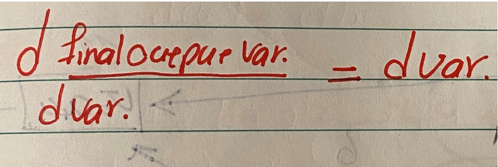

### صفحه اول

### Neural Network and deep learning:

### AI is the new Electricity.

### What is Neural Network:

در حقیقت
Deep learning به train کردن Neural Network اشاره دارد ولی واقعا neural network چیست؟

در این قسمت با Neural Network بیشتر آشنا خواهیم شد.

با مثال معروف خودمان شروع می کنیم.
Housing price prediction
اطلاعات 6 خانه داریم و نموداری را به آن ها نسبت می دهیم که ما کمک میکند تا بتوانیم به تخمین درمورد سایر موارد (unseen data) برسیم .

<!-- -

- -->

\*ما می دانیم که قیمت منفی نخواهد بود لذا این قسمت از نمودار را صفر در نظر میگیریم.

حقیقت این نمودار که اینجا رسم کردیم،یک NN ساده است.شاید میتوان گفت که ساده‌ترین NN ممکن!

<!-- -

- -->

کاری که neuron می کند.1- سایز(x)به عنوان ورودی می گیرد. linear function -2 را حساب می کند.3- قسمت منفی را صفر در نظر می گیرد. 4- تخمین خروجی می کند.

### صفحه دوم

در مسائل NN ،این تابع را بسیار خواهیم دید:

<!-- -

- -->

شبکه های عصبی پیچیده تر از کنار هم قرار گرفتن و پیوند همین ساختار ساده ( single NN ) بدست می آیند.

فرض کنیم در مثال خودمان ( تخمین قیمت خانه) پارامتر های بیشتری (علاوه بر سایز) دخیل باشند.

<!-- -

- -->

این مثال،یک مثال فوق العادست برای درک ساعت ها فکر کردن را دارد.

نکته ی بسیار جالب در مورد NN آن است که فقط لازم است که ما تعدادی ورودی (x) و خروجی متناظر را به شبکه بدهیم و تمامی موارد دیگر توسط خود NN تنظیم میشود.

آنچه که ما در حقیقت پیاده کرده ایم چنین چیزی است.

<!-- -

- -->

### صفحه سوم

در حقیقت بجای آنکه ما بگوییم که neuron اول در hidden layer باید family size باشد و فقط به x1 و x2 وابسته است همه ی ورودی را در اختیار NN قرار میدهیم و خودش در مورد اینکه این NEURON چه باشد و به کدام ورودی وابسته باشد تصمیم می
گیرد.

The remarkable thing about NN is that , given enough data about x and y , (given enough training examples about x & y)
NN will be remarkably good at figuring out functions that accurately map from x to y

Supervised learning with neural networks:

در supervised learning ما یک سری ورودی x داریم و خروجی متناظر y و به دنبال آن هستیم که تابعی پیدا کنیم که این x ها را به y متناظر کند.مثل همین مثال house price

در مثال NN ، دو مفهوم وجود دارد که به توضیح آنها می پردازیم:

داده ساختاریافته(STRUCTURED DATA):در این نوع دیتا هر یک از feature های ورودی ساختار منظمی دارند مثل:

<!---  --->

### صفحه چهارم

سوالی که پیش می آید آن است که اگر ایده ی NN دهه ها پیش مطرح شده است چرا اخیرا اینقدر مورد توجه قرار گرفته است؟

<!---  --->

در این روش ها،تا جایی با افزودن data جدید،performance بالاتر میرود ولی از جایی به بعد در حقیقت اشباع میشود و افزودن data جدید تاثیری بر کارایی سیستم ندارد.

اتفاقی که در حدود ۲۰ سال گذشته رخ داده آن است که ما از یک حجم کم از اطلاعات حجم بسیار زیادی از داده رسیده ایم و این مساله بخاطر digitalization است.

در حقیقت به نقطه ای رسیدیم که حجم بسیار خوبی از اطلاعات را ببینیم ولی روش های مرسوم قادر نبودند از آن برای بهبود کارایی استفاده کنند.

و بنابراین اگر performance در این حد میخواهیم به ۲ موضوع نیاز داریم:

۱.یک NN نسبتا بزرگ

۲.یک حجم بسیار وسیع از اطلاعات

نتیحه از 1و2:
فراهم کردن این ۲ پارامتر به معنای نیاز به امکانات سخت افزاری و نرم افزاری پیچیده است که تنها در همین چند سال اخیر فراهم شده است.

### صفحه پنجم

در حقیقت منظور از Amount of Data که روی محور x نمودار مشخص شده Amount of Labeled Data است (x,y) که در آن ورودی و خروجی متناظر برای dataset مشخص،معین شده است.

#training examples⇐(m)

نکته‌ی بعدی آنست در جایی که small training set داریم،ممکن است حتی روش‌های قدیمی (,...SUM) بهتر از یک large NN به شدت قوی‌تر عمل می کند.

پارامترهایی که پیش از این باعث پیشرفت NN شده‌اند،دسترسی بیشتر به Data و Computation بوده است حال آن که در سال‌های اخیر استفاده از Algorithm های جدید،مورد توجه است.

\*این الگوریتم ها در سرعت بخشی به NN بسیار موثر بوده‌اند.یکی از ساده‌ترین مثال‌ها در این زمینه ، سوییچ از Sigmoid به relu بوده است.

<!---  --->

در این قسمت ها،شیب بسیار کم است و gradiene هم بسیار کم (تقریباً صفر) است و بنابراین learning بسیار کندی میشود.

### صفحه ششم

یکی دیگر از دلایلی که سرعت الگوریتم ها اینقدر برای ما مهم است آن است که مهمولاً در پیاده سازی الگوریتم‌ها این چرخه طی میشود. ابتدا ایده‌ای داریم
این ایده تبدیل به کد می‌شود.
کد را امتحان میکنیم.

<!---  --->

در این فرایند سرعت بسیار مهم است.

Logistic Regression as a Neural Network -Binary Classification:

در این هفته در مورد مبانی NN صحبت خواهیم کرد:
برای پیاده سازی یک NN، مجموعه‌ای از تکنیک‌ها وجود دارد که بهره‌گیری از آن‌ها به افزایش کارایی NN کمک خواهد کرد.
مثلاً اجتناب از بکار بردن حلقه‌ی for در پیاده‌سازی الگوریتم‌ها.

الگوریتم Logistic regression برای binary classification است.

Binary Classification

<!---  --->

میدانیم که هر تصویر RGB از سه ماتریس تشکیل شده. حال فرض کنیم عکس در ابعاد 64\*64 داریم.

در این حالت در حقیقت 64\*64\*3 تا مقدار داریم.برای آنکه این مقادیر را به یک feature vector تبدیل کنیم، همه را به یک بردار عمودی تبدیل میکنیم.

### صفحه هفتم

<!---  --->

Notation is so important

بعضی وقت ها از n برای بیان ابعاد ورودی استفاده میشود.

Notation:
A single training example is represented by (x,y)

<!---  --->

همچنین از M train و M test هم برای بیان تعداد مثال های موجود در هر مجموعه استفاده میشود.

### صفحه هشتم

یکی از روش های مرسوم برای نمایش training examples این است :

<!---  --->

در حقیقت هر یک از m مثال training را در یک ستون قرار میدهیم.

<!---  --->

Logistic regression:

یکی از learning algorithm هایی است که در مسائل binary classification استفاده میشود.جایی که خروجی یا صفر خواهد بود و یا یک.

فرض کنیم یک ورودی x داریم مثلا یک تصویر که میخواهیم ببینیم آیا در آن گربه هست یا خیر؟

و می خواهیم یک prediction داشته باشیم (y^)

که در حقیقت تخمین ما از y است.

در حقیقت y^ ، احتمال آن است که y=1 باشد وقتی که ورودی برابر با x است.

<!---  --->

### صفحه نهم

به بیان دیگر، اگر x یک تصویر ورودی باشد، y به ما میگوید چقدر احتمال دارد که تصویر آن ، تصویر یک گربه باشد.

همانطور که پیش‌تر گفتیم x ابعادی با Nx دارد. Rnxx با توجه به این موضوع پارامترهای logistic regression یا همان W:

Parametrs: WRnx , bR

در این جا b یک عدد حقیقی است.

به نظر میرسه داریم فقط درمورد یک neuron در هر لایه صحبت می کنیم.

<!---  --->

فرض کنیم ورودی x را داریم،همچنین پارامترهای W,b را هم داریم،چگونه y تولید می شود.

<!---  --->

دلیل استفاده از آن است که ما می خواهیم y بیانگر احتمال باشد، یعنی عددی بین صفر و یک.

<!---  --->

### صفحه دهم

در استفاده از logistic regression ، هدف ما پیدا کردن w و b مناسب است بطوریکه y^ احتمال درستی باشد.
برای فرآیند learning و train کردن b,w قبل از هرچیز نیاز به یک cost function داریم که در این قسمت به آن میپردازیم:
گفتیم که :

<!---  --->

از طرفی ما مجموعه ای از m تا training examples داریم:

<!---  --->

Loss(error) function:

<!---  --->

این یکی از روش هایی است که میتوانیم از آن استفاده کنیم (squared-error)
ولی در logistic regression معمولا از این فرمول استفاده نمیشود.
چرا که کار با آن در optimization که بعدا در مورد آن حرف میزنیم،آسان نیست.
در حقیقت loss function ابزار ماست برای آن که دریابیم تا چه حد تخمین ما y^ درست بوده و به واقعیت y نزدیک بوده است.

### صفحه یازدهم

آنچه که ما از آن به عنوان loss function استفاده می کنیم این است طبیعتاً خواسته‌ی ما این است که فارغ از هر تابعی که برای loss استفاده می کنیم،مقدار آن کمترین مقدار ممکن باشد.

L(y^,y)=-(y log y^ + (1-y)log(1-y^))
If y=1⇒ L (y^,y)=-logy^

این یعنی اگر y=1 باشد، ما ترجیح می دهیم که y^ تا حد ممکن بزرگ باشد تا که loss کم شود.

از سوی دیگر بزرگ ترین مقدار ممکن برای y^ معادل با یک(1) است پس وقتی که y=1 است، y^=1 خواهد بود.

If y=o ⇒L(y^-y)=-log (1-y^)

بنابراین ترجیح ما این است که (log(1-y تا حد ممکن بزرگ باشد پس (y-1) باید بزرگ باشد پس y^ باید کمترین مقدار را داشته باشد. لذا:y^=0

نکته‌ی آخر اینکه تا اینجا training examples بیان شده است.

در اینجا ما Cost function را تعریف میکنیم که در حقیقت به ما میگوید چقدر خوب باید عمل کرده‌ایم روی مجموعه کامل training set

<!---  --->

### صفحه دوازهم

بنابراین loss function فقط روی
یک training example عمل میکند و cost function روی مجموعه ی کامل training example

گرادیان کاهشی (Gradient descent) :

تا اینجا در مورد logistic regression model
و loss function و cost function آموختم

حال در مورد موضوع مهمی به نام gradient descent حرف خواهیم زد.
در حقیقت میخواهیم بفهمیم چگونه میتوان با استفاده
از gradient descent
مدل را train کرد و b و w مناسب را یافت.

یادآوری:

Logistic regression algorithm

<!---  --->

Cost function:

<!---  --->

در حقیقت cost function مشخص میکند که تا چه حد b و w روی training set خوب عمل میکنند؟!

در حقیقت،ما به دنبال b و w هستیم که به ازای آن ها (b,w)[
کمترین مقدار ممکن را داشته باشد.

بنابراین برای ما بهتر است که (w,b)[ یک تابع convex یا همگرا باشد و نه یک تابع non-convex

### صفحه سیزدهم

این یکی از دلایلی بود که ما از squared error برای loss استفاده نکردیم.

برای آن که مقادیر مناسب b , w را پیدا کنیم،ابتدا مقدار اولیه ای بر آن ها در نظر میگیریم و کاری که با استفاده از gradient descent انجام میدهیم آن است که گام به گام مقادیر b , w را بهبود می بخشیم تا [ به کمترین مقدار خود برسد.برای سادگی بیشتر فرض میکنیم [ فقط به w وابسته است.

<!---  --->

کاری که ما انجام میدهیم مقدار w را بدین صورت آپدیت میکنیم.

<!---  --->

این کار را ادامه میدهیم تا الگوریتم همگرا شود.

پارامتر Learning rate=> اندازی ی گامی را که در هر مرحله برمیداریم کنترل میکند
در کد نویسی از این عبارت برای d](w) / dw استفاده میکند.⇒

W=w-∝ dw

### صفحه چهاردهم

فرض کنیم که W در نقطه 1 باشد:

میدانیم که مشتق ، در حقیقت شیب تابع در هر نقطه است. لذا شیب تابع در نقطه‌ی W مثبت است.

پس W جدید کمتر از W قدیم است. پس همانطور که مشخص است W دارد در مسیر درست (کم شدن J) حرکت میکند.

حال فرض کنیم W از نقطه‌ی z کار خود را شروع کند. در این صورت شیب در این نقطه منفی خواهد بود و لذا W جدید بزرگتر از W قدیم. پس بازهم W به درستی آپدیت میشود.

حال اگر b را هم در Cost function در نظر بگیریم.(J(w,b

<!---  --->

گراف محاسباتی (Computation Graph) :

به طور کلی Computation مربوط به یک NN دو قسمت دارد:

1- forward prop ⇒ to compute output

2- back prop ⇒ to update weights

برای توضیح هرچه بهتر computation، با مثال ساده‌ای شروع میکنیم.فرض کنیم میخواهیم تابع زیر را حساب کنیم.

J(a,b,c)=3(a+bc)

### صفحه پانزدهم

محاسبه‌ی این تابع سه مرحله دارد: ابتدا b\*c را حساب میکنیم. سپس حاصل را با a جمع میکنیم و نهایتاً حاصل را در 3 ضرب میکنیم.

میتوان این سه مرحله را در computation رسم کرد.

a=bc

v=a+u

J=3v

<!---  --->

مثلاً اگر فرض کنیم c=2,b=3,a=5 باشد.

<!---  --->

خب تا اینجا دیدیم که چگونه مسیر رفت محاسبه میشود در این قسمت چگونگی محاسبه‌ی مسیر برگشت را بررسی میکنیم.

Derivatives With a Computation Graph:

ابتدا نحوه‌ی محاسبه‌ی مشتق ها را بررسی میکنیم.

ابتدا فرض کنیم میخواهیم dj/dv را محاسبه کنیم.

J=3v⇒dj/dv=3

### صفحه شانزدهم

<!---  --->

حال dj/da را حساب میکنیم

<!---  --->

وقتی کد میزنیم ، معمولاً یک "final output variable" داریم که برای ما مهم است در اینجا J هست.

برای راحتی بیشتر فقط یک قسمت را در نامگذاری بررسی میکنیم.

<!---  --->

با این تفاسیر da یعنی dj/da.

<!---  --->

Logistic Regression Gradient Descent:

در این بخش راجع به این صحبت میکنیم که چگونه میتوان مشتقات را حساب کرد تا با استفاده از آن gradient descent برای logistic regresion پیاده‌سازی شود.

<!---  --->

فعلاً فقط بر روی یک مثال از fraing set متمرکز میشویم.

### صفحه هفدهم

### صفحه هجدهم

Validation generator دقیقاً مثل train-generator است.

```ruby
validation-generator =test-datagen.flow-from-directory(validation-dir,
target-size=(300,300),
batch-size=32,
class-mode=’binary’)
```

در حقیقت کاری که ما باید بکنیم آن است که ترتیب زیر تصاویر را در یک directory,ذخیره کنیم و با استفاده از این API آن ها را load کنیم.

<!--  -->

خیلی جالب شد.وقتی که من به این ترتیب آدرس میدم و عمل میکنم(مثلاً آدرس training را میدهیم)،عکس های 1،2،3←lable
horses می خورند و کود میشود و عکس‌ها : Reza- Ahp-Al

### صفحه نوزدهم

در اینجا یک مثال human vs horses را بررسی میکنیم.از آنجا که تصاویر و feature ها نسبتاً بزرگتر از تمرینات قبلی هستند،3لایه convolution قبل از DNN در نظر گرفتیم.

```ruby
model=t.f.keras.models.sequential([t.f.keras.conv ZD(lb,(3,3),activation=’relu’,input-shape=(300,700,3)

t.f.keras.layers.Max Pool ZD(2,2),
t.f.keras.layers.Conv ZD (32,(3,3),activation=’relu’),
t.f.keras.layers.Max Pool ZD (2,2)
t.f.keras.layers.Con ZD(64,(3,3),activation=’relu’),
t.f.keras.layers.Max Pool ZD(2,2)
t.f.keras.layers.Flatten( ),
t.f.keras.layers.Dense(512,activation=’relu’)
t.f.keras.layers.Dense(1,activation=’sigmoid’)])

```

نکته:تصاویر به کار گرفته شده رنگی می باشند.به همین دلیل input-shape به صورت (300,700,3) می باشد

نکته:Sigmoid تابع بسیار مناسبی است برای binary cbssifi otb ← نکته‌اش این است که وقتی از sigmoid در خروجی استفاده میکنیم،باید یک neuron در نظر بگیریم. برخلاف softmax که نیاز به 2 neuron در خروجی دارد.
در حقیقت کاری که ما باید بکنیم آن است که ترتیب زیر تصاویر را در یک directory,ذخیره کنیم و با استفاده از این API آن ها را load کنیم.

```ruby
form tensorflow,keras.optimizers import RMSprop
model.compile(loss=’binary-crossentory’,optimizer=RMSprop(Ir=0.001),metrics=[‘acc’])
```

حالا-سراغ trainig میرویم. در اینجا fit کمی متفاوت است.

### صفحه بیستم

```ruby
History=model.fit-generator
Train generator,
Steps.per-epoch=8,
Epoch=15,
Validation-data=validation-generator,
Validation steps=8,
Verbose=2,
```

از آنجایی که به جای یک dataset از یک generator استفاده می کنیم بجای model.fit هم از model.fit-generator استفاده می کنیم
بعد از آنکه training انجام شد،باید predict کنیم و این کد این کار را برای ما انجام می دهد.

```ruby
Import numpy as np
From google colab import files
From keras . preprocessing import image
Uploaded=files.upload
For fn in uploaded keys
Path=content + fn
Img=image load-image(path,target-size (300,300))
X=image.img-to-array (img)
X=np.expand-dims(x,axis=0)
```
